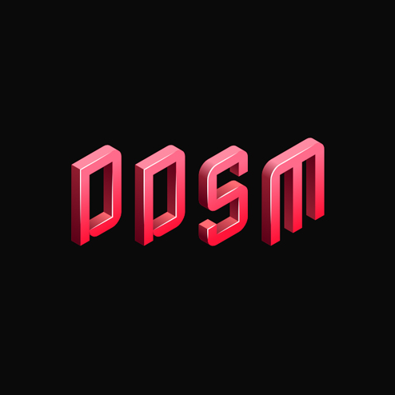

<p align="center">
  
</p>

<h1 align="center">Deadlock Dedicated Server Manager</h1>

> **Work in progress.** This project is under active development and comes with no guarantees of stability or flawless operation. Use at your own risk.

> **CLI/TUI: Beta.** The Go CLI and terminal UI are in beta. Features may change, and bugs are expected. The web dashboard is more stable.

Manage multiple [Deadlock](https://store.steampowered.com/app/1422450/Deadlock/) dedicated server instances on Linux. Includes a Go CLI with an interactive TUI and a Next.js web dashboard.

Built on top of [deadlock-dedicated-proton-server](https://github.com/Oskar-Sterner/deadlock-dedicated-proton-server).

## Project Structure

```
ddsm-project/
├── cli/                 # Go CLI + interactive TUI
│   ├── cmd/ddsm/        # Entry point
│   └── internal/
│       ├── ddsm/        # Core modules (config, db, docker, rcon, servers, autosleep, doctor)
│       └── tui/         # Bubble Tea TUI (servers, console, config, tools tabs)
├── web/                 # Next.js web dashboard
│   └── src/
│       ├── app/         # App Router pages + API routes
│       ├── components/  # React components
│       └── lib/         # Backend logic
├── data/                # Runtime data (gitignored)
└── README.md
```

## CLI Quick Start

### Prerequisites

- Go 1.22+
- Docker
- The `deadlock-server` Docker image from [deadlock-dedicated-proton-server](https://github.com/Oskar-Sterner/deadlock-dedicated-proton-server)

### Build and Install

```bash
cd cli
go build -o ddsm ./cmd/ddsm
sudo install -m 0755 ddsm /usr/local/bin/ddsm
```

### Usage

Launch the interactive TUI:

```bash
ddsm
```

Or use CLI commands directly:

```bash
ddsm --help
```

### Commands

| Command              | Description                          |
|----------------------|--------------------------------------|
| `ddsm`               | Launch interactive TUI               |
| `ddsm status`        | List all servers with status         |
| `ddsm create`        | Create a new server (interactive)    |
| `ddsm start [id\|all]`| Start server(s)                      |
| `ddsm stop [id\|all]` | Stop server(s)                       |
| `ddsm restart [id\|all]` | Restart server(s)                 |
| `ddsm delete [id]`   | Delete a server                      |
| `ddsm logs [id]`     | Tail live server logs                |
| `ddsm rcon [id] [cmd]` | Execute RCON command               |
| `ddsm attach [id]`   | Attach to server container           |
| `ddsm config`        | Show current configuration           |
| `ddsm config edit`   | Open config in $EDITOR               |
| `ddsm doctor`        | Run health diagnostics               |

## Web Dashboard Quick Start

```bash
cd web
bun install
npm rebuild better-sqlite3
cp .env.example .env
bun run build
bun run start -- -H 0.0.0.0 -p 3000
```

Visit `http://your-server-ip:3000` to access the dashboard.

## Configuration

### CLI

The CLI reads configuration from these paths (first found wins):

1. `~/.ddsm/config.yaml`
2. `/etc/ddsm/config.yaml`

Environment variables override file values (prefixed with `DDSM_`).

Example `~/.ddsm/config.yaml`:

```yaml
server_ip: "203.0.113.10"
rcon_password: "your_rcon_password"
servers_dir: "/opt/deadlock-servers"
docker_image: "deadlock-server"
db_path: "~/.ddsm/ddsm.db"
autosleep:
  enabled: true
  idle_timeout: 300
  poll_interval: 15
```

### Web Dashboard

Copy `web/.env.example` to `web/.env` and configure:

```ini
DDSM_SERVER_IP=0.0.0.0
DDSM_RCON_PASSWORD=ddsm_rcon_secret
DDSM_SERVERS_DIR=/opt/deadlock-servers
DDSM_DOCKER_IMAGE=deadlock-server
```

## Tech Stack

**CLI (beta):**
- [Go](https://go.dev/) 1.22+
- [Bubble Tea](https://github.com/charmbracelet/bubbletea) -- terminal UI framework
- [Lip Gloss](https://github.com/charmbracelet/lipgloss) -- TUI styling
- [Docker SDK for Go](https://github.com/docker/docker) -- Docker Engine API
- [go-sqlite](https://github.com/glebarez/go-sqlite) -- pure Go SQLite driver
- [james4k/rcon](https://github.com/james4k/rcon) -- Source RCON client

**Web Dashboard:**
- [Bun](https://bun.sh/) runtime
- [Next.js](https://nextjs.org/) (App Router)
- [Tailwind CSS](https://tailwindcss.com/) v4
- [Framer Motion](https://www.framer.com/motion/)
- [better-sqlite3](https://github.com/WiseLibs/better-sqlite3)
- [Dockerode](https://github.com/apocas/dockerode)

## License

MIT
